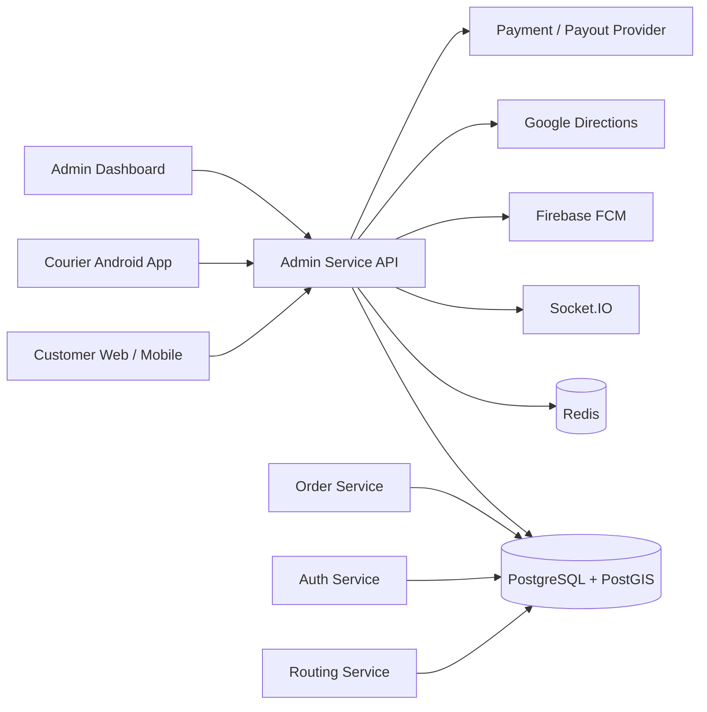

# LANCAR

LANCAR adalah platform logistik end-to-end yang mencakup customer portal, admin dashboard, backend services, dan aplikasi Android untuk kurir/customer. Fokus fase saat ini adalah layanan on-demand bergaya GoSend: customer membuat order, sistem menawarkan pekerjaan ke kurir terdekat/eligible, kurir mengambil barang, melakukan verifikasi pickup, mengantar, mengunggah POD, lalu earning masuk ke ledger kurir.

## Product Scope

- Customer web portal untuk order, pembayaran, tracking, chat, resi, dan dispute.
- Admin dashboard untuk operasi order, pricing, courier review, zones, courier safety, finance, payout, audit, dan readiness.
- Android courier app untuk role on-demand, pickup only, dan delivery only.
- Android customer app untuk tracking, chat, status perjalanan, dan bukti pengiriman.
- Backend services untuk auth, admin/API gateway, order/pricing, routing, payment, notification, realtime, payout, dan audit.

## Repository Layout

| Path | Description |
| --- | --- |
| `admin-dashboard/` | React + Vite admin dashboard untuk operasional LANCAR. |
| `frontend/` | Next.js customer web portal. |
| `android-app/` | Android native courier app. |
| `android-app-customer/` | Android native customer app. |
| `backend/admin-service/` | Node.js/TypeScript API utama untuk admin, mobile, customer tracking, realtime, notification, payout, dan upload. |
| `backend/auth-service/` | Go auth service. |
| `backend/order-service/` | Go order/pricing service. |
| `backend/routing-service/` | Go routing/feature service. |
| `backend/payment-service/` | Go wallet/payment support service. |
| `database/migrations/` | Goose SQL migrations. |
| `docs/` | Runbook dan checklist operasional. |
| `docker-compose.yml` | Local orchestration untuk database, Redis, backend services, frontend, dan admin. |

## Architecture



## Core On-Demand Flow

1. Customer membuat order on-demand.
2. Backend menghitung pricing, payout bersih kurir, dan settlement.
3. Sistem dispatch offer secara sequential ke kurir eligible.
4. Kurir menerima atau melewati offer dengan TTL.
5. Setelah diterima, customer menerima status realtime dan tracking kurir.
6. Kurir menuju pickup.
7. Di titik pickup, kurir wajib scan/input kode paket dan foto barang.
8. Jika barang tidak sesuai sebelum pickup selesai, kurir bisa cancel dengan reason dan foto bukti.
9. Setelah pickup valid, kurir wajib mengantar sampai dropoff.
10. Di tujuan, kurir upload POD.
11. Customer melihat status final, POD, timeline, chat, dan public tracking bila link dibagikan.
12. Ledger earning kurir masuk setelah POD valid.

## Courier App Capabilities

- Role-aware UI: on-demand, pickup only, delivery only.
- On-demand offer card dengan TTL.
- Payout estimate bersih sesuai admin pricing.
- Coverage layanan berdasarkan kendaraan dan service capability.
- On-duty guard berdasarkan active zone dan lokasi kurir.
- Pickup verification: scan/input kode paket wajib dan foto barang wajib.
- Delivery verification: POD wajib di lokasi tujuan.
- Cancellation sebelum pickup selesai dengan reason dan foto.
- Realtime chat dengan customer.
- Offline-first location replay dengan `client_location_id` agar retry tidak membuat lokasi ganda.
- Payout UX: saldo tersedia, rekening masked, request pencairan, PIN step-up, status, dan history.

## Customer Tracking

- Web order detail menerima realtime event tanpa refresh manual.
- Mobile customer tracking menerima stage, timeline, location, chat, proof, dan POD/cancellation detail.
- Public tracking link tersedia di customer web setelah kurir menerima pekerjaan:
  - `POST /auth/web/orders/:id/public-tracking-link`
  - Public page: `/track/:token`
- Public token disimpan sebagai hash dan memiliki TTL.

## Payout And Finance Safety

Payout kurir dibangun dengan prinsip ledger-first:

- Saldo dihitung dari ledger, bukan update saldo langsung.
- Request pencairan punya idempotency key.
- Rekening kurir harus verified sebelum pencairan eligible.
- Step-up PIN untuk mobile payout request.
- Auto/manual review berbasis risk score dan velocity limit.
- Kill switch untuk menghentikan auto payout.
- Provider dispatch memakai idempotency key.
- Webhook provider wajib signature verification.
- Reversal dilakukan lewat ledger reversal jika payout gagal.
- Semua aksi payout dan rekening masuk audit trail.

## Prerequisites

- Docker Desktop.
- Node.js sesuai project lockfile/runtime lokal.
- npm.
- Go toolchain untuk service Go jika menjalankan di luar Docker.
- PostgreSQL client dan Goose untuk migration local check.
- Android Studio untuk build/test Android apps.
- JDK 17 untuk Android builds.

## Environment Setup

Copy template environment:

```bash
cp .env.example .env
```

Isi secret sesuai environment. Jangan commit `.env`.

Secret penting:

```env
JWT_SECRET=
JWT_REFRESH_SECRET=
MIDTRANS_SERVER_KEY=
MIDTRANS_CLIENT_KEY=
GOOGLE_MAPS_API_KEY=
GOOGLE_DIRECTIONS_API_KEY=
FIREBASE_PROJECT_ID=
FIREBASE_SERVICE_ACCOUNT=
AWS_ACCESS_KEY_ID=
AWS_SECRET_ACCESS_KEY=
XENDIT_DISBURSEMENT_KEY=
FLIP_SECRET_KEY=
```

Untuk on-demand tracking dan FCM, baca:

- `docs/on-demand-external-keys-setup.md`
- `docs/on-demand-fcm-staging-checklist.md`

Readiness endpoint:

```bash
curl http://localhost:3001/api/v1/system/on-demand-readiness
```

Target sebelum device test:

```json
{
  "overall_status": "ready_for_staging_validation"
}
```

## Running With Docker

Start core services:

```bash
docker compose up -d
```

Run migrations through compose profile if the goose image is available:

```bash
docker compose run --rm migrate
```

If the registry blocks the goose image, run local Goose:

```bash
goose -dir database/migrations postgres "host=localhost port=5432 user=postgres password=1234 dbname=lancar sslmode=disable" up
```

Common local URLs:

- Customer web: `http://localhost:3000`
- Admin dashboard: `http://localhost:3002`
- Admin service/API: `http://localhost:3001`
- Auth service: `http://localhost:8081`
- Routing service: `http://localhost:8082`
- Order service: `http://localhost:8083`
- Payment service: `http://localhost:8084`

## Local Development

Admin service:

```bash
cd backend/admin-service
npm install
npm run build
npm test -- --runInBand
```

Customer web:

```bash
cd frontend
npm install
npm run dev
npm run build
```

Admin dashboard:

```bash
cd admin-dashboard
npm install
npm run dev
npm run build
```

Courier Android app:

```bash
cd android-app
./gradlew testDebugUnitTest assembleDebug
```

Customer Android app:

```bash
cd android-app-customer
./gradlew testDebugUnitTest assembleDebug
```

On Windows PowerShell, use:

```powershell
.\gradlew.bat testDebugUnitTest assembleDebug
```

## Database Migrations

Migrations live in `database/migrations/` and are ordered for Goose.

Clean migration validation example:

```powershell
$env:PGPASSWORD='1234'
psql -h localhost -U postgres -d postgres -c "DROP DATABASE IF EXISTS lancar_migration_check;" -c "CREATE DATABASE lancar_migration_check;"
goose -dir database/migrations postgres "host=localhost port=5432 user=postgres password=1234 dbname=lancar_migration_check sslmode=disable" up
psql -h localhost -U postgres -d postgres -c "DROP DATABASE IF EXISTS lancar_migration_check;"
```

## Testing Matrix

Before pushing staging, run the relevant checks:

```bash
cd backend/admin-service
npm run build
npm test -- --runInBand
```

```bash
cd frontend
npm run build
```

```bash
cd admin-dashboard
npm run build
```

```powershell
cd android-app
.\gradlew.bat testDebugUnitTest assembleDebug
```

```powershell
cd android-app-customer
.\gradlew.bat testDebugUnitTest assembleDebug
```

Migration test should run on a clean database before staging deploy.

## CI/CD

GitHub Actions workflows live in `.github/workflows/`:

- `staging.yml`
- `production.yml`
- `android-apps.yml`
- `development.yml`
- `pr-quality.yml`
- `auto-merge.yml`

Staging commonly checks frontend build, service tests, migration test, security scan, Docker build/push, staging deploy, and browser validation.

## Operational Docs

- `docs/on-demand-incident-runbook.md`: incident response untuk tracking, push, chat, POD, dan ledger.
- `docs/on-demand-external-keys-setup.md`: setup Google Maps/Directions dan Firebase Admin/FCM.
- `docs/on-demand-fcm-staging-checklist.md`: checklist device test FCM foreground/background/killed app.

## Important API Surfaces

System:

- `GET /health`
- `GET /admin/health`
- `GET /api/v1/system/latest-version`
- `GET /api/v1/system/on-demand-readiness`

Courier mobile:

- `POST /api/v1/auth/courier/login`
- `GET /api/v1/courier/profile`
- `GET /api/v1/courier/orders`
- `GET /api/v1/courier/offers`
- `POST /api/v1/courier/offers/:id/accept`
- `POST /api/v1/courier/offers/:id/reject`
- `POST /api/v1/courier/orders/:orderId/cancel-pickup`
- `POST /api/v1/orders/scan`
- `POST /api/v1/orders/pod/upload`
- `POST /api/v1/tracking/sync`
- `POST /api/v1/courier/fcm/register`

Customer:

- `POST /auth/web/orders`
- `GET /auth/web/orders/:id`
- `GET /api/v1/customer/orders/:id/tracking-detail`
- `POST /auth/web/orders/:id/public-tracking-link`
- `GET /track/:token`

Finance:

- `GET /api/v1/courier/payout/summary`
- `GET /api/v1/courier/payout/requests`
- `POST /api/v1/courier/payout/requests`
- `GET /admin/finance/payout-review-queue`
- `POST /admin/finance/payout-requests/:id/review-action`
- `POST /admin/finance/payouts/dispatch-approved`
- `POST /admin/finance/payouts/reconcile`

## Security Notes

- Never commit `.env`, Firebase service account JSON, provider secret keys, or production API keys.
- Use TOTP for admin finance actions.
- Keep payout operations append-only through ledger entries.
- Public tracking tokens must remain hashed in database.
- Restrict Google Maps API keys by API and environment.
- Firebase Admin key should live in secret manager or CI/CD encrypted secrets.

## Current Manual Waiting Items

These are environment/device tasks, not missing code:

- Insert staging/production Google Maps and Firebase secrets.
- Run device/emulator staging login for customer and courier.
- Validate FCM real token delivery in foreground, background, and killed app.
- Validate GPS tracking and geofence behavior on real device.

## Troubleshooting

If Android cannot find `adb`, add Android platform-tools to Windows PATH.

If Docker migration fails with `ghcr.io/pressly/goose:latest denied`, use local `goose.exe` as shown in the migration section.

If tracking has no ETA/polyline, check:

- `GOOGLE_MAPS_API_KEY`
- `GOOGLE_DIRECTIONS_API_KEY`
- Directions API enabled in Google Cloud.
- `GET /api/v1/system/on-demand-readiness`

If FCM push does not arrive, check:

- `FIREBASE_SERVICE_ACCOUNT`
- app `google-services.json`
- token rows in `user_devices`
- `docs/on-demand-fcm-staging-checklist.md`

## Status

Code-level on-demand customer-to-courier flow is ready for staging validation. Remaining proof points depend on real secrets and real device/emulator execution.
