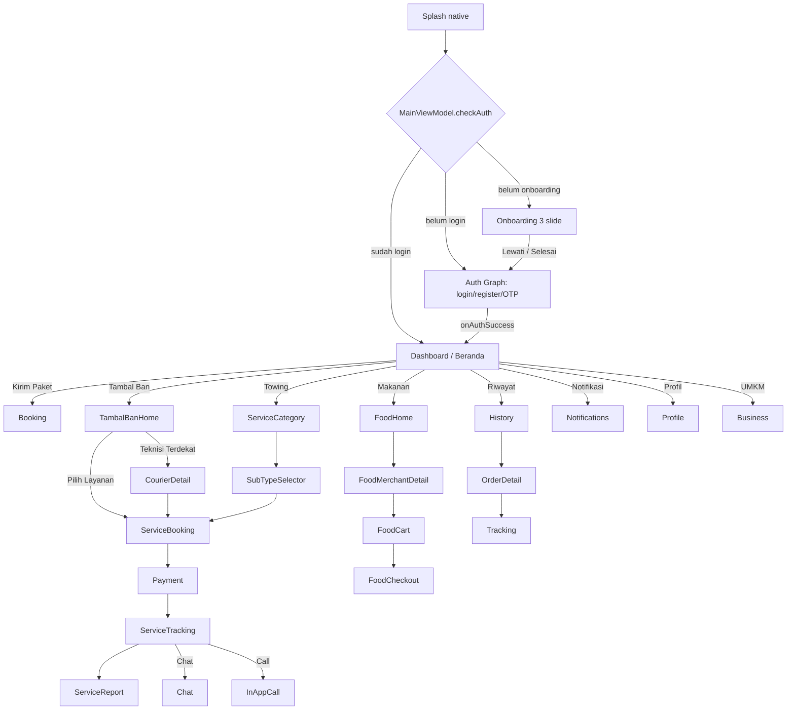

# TEMBUS Customer App — Flow & 2026 UI/UX Audit

> Sumber: `android-app-customer` (`Screen.kt`, `RootNavGraph.kt`, `DashboardScreen.kt`, `OnboardingScreen.kt`, `TambalBan*`, `Food*`, `Service*`).
> Audit: screenshot emulator-5554 + UI tree + pixel-contrast scan (bukan tebakan vision).

## 1. Navigation Flow (Mermaid)

## 2. Entry / Boot

| State | Route |
|---|---|
| First launch, no onboarding | `onboarding` |
| No valid token | `auth_graph` |
| Valid session | `dashboard` |

`startDestination` ditentukan di `MainViewModel` (onboarding selesai + token valid).

## 3. Booking hop count (2026 target ≤3)

| Jalur | Hop | Status |
|---|---|---|
| Kirim Paket | Beranda → Booking → Payment | ✅ 2-3 |
| Tambal Ban (utama) | Beranda → TambalBanHome → ServiceBooking → Payment | ✅ 3 |
| Tambal Ban (lewat teknisi) | … → CourierDetail → ServiceBooking | ⚠️ 4-5 (secondary, bisa di-skip) |
| Towing | Beranda → ServiceCategory → SubTypeSelector → ServiceBooking | ⚠️ 3-4 |
| Makanan | Beranda → FoodHome → Merchant → Cart → Checkout | ⚠️ 4 |

**Perbaikan yang sudah dilakukan:** kartu "Sedang Berjalan" dihapus dari Beranda (pindah ke Tracking/Riwayat). Status bar Beranda putih di hero hijau (per-screen).

## 4. 2026 Standards Checklist

| Standar | Status | Catatan |
|---|---|---|
| WCAG 2.2 AA kontras 4.5:1 / 3:1 | 🟡 | Token `Color.kt` on-spec (#003A20 / #F97316); belum audit tiap screen |
| Touch target ≥48dp | ✅ | MD3 default |
| Bottom nav ≤5 item | ✅ | Beranda/Riwayat/Notifikasi/Profil/Business |
| Status bar adaptif (putih di gelap) | ✅ | per-screen `WindowCompat` |
| Deep link / notif → screen | ✅ | `openForegroundNotification` |
| Dark mode | 🟡 | token ada, belum test visual |
| First-load <3s | ⚠️ | splash cap 1s; ART verify emulator lambat (bukan logic) |
| Onboarding skip + progress | ✅ | "Lewati" ghost pill |

## 5. Rekomendasi (next)

1. Audit kontras pixel tiap screen (WCAG 2.2 AA) → fix yang <4.5:1.
2. Pendekin Towing & Food jadi ≤3 hop (gabung SubTypeSelector ke Category; Cart→Checkout 1 layar).
3. Empty-state + skeleton standar di tiap list.
4. Dark-mode visual test.
