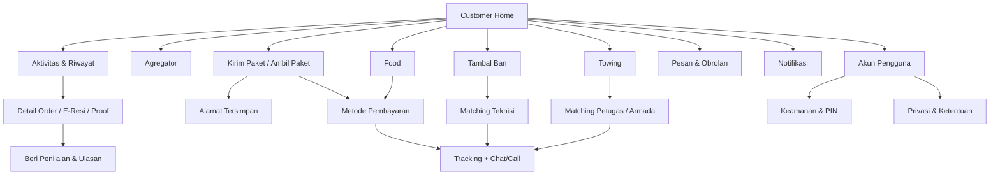

# Customer Figma ↔ Code Flow Map 2026

Dokumen ringkas ini menjadi peta navigasi sebelum implementasi `UIUX-2026-008`. Detail acceptance dan verification ada di [task-customer-figma-code-parity-2026.md](../../task-customer-figma-code-parity-2026.md).

## Shell utama



## Flow map

| Flow | Figma intent | Android implementation boundary | Outcome |
| --- | --- | --- | --- |
| 01 | Home, service discovery, wallet, promo, bottom nav | `DashboardScreen` + `DashboardHomeComponents` + `RootNavGraph` | User tahu layanan dan next action dalam satu layar |
| 02 | Aktivitas, active order, history, detail, e-resi | `OrderHistoryScreen` + `OrderDetailScreen` + policy/state | User dapat menemukan, memahami, dan mengulang order |
| 03 | Parcel form, pickup/dropoff, detail paket, vehicle/expedition, address | booking module + address book | Order parcel dapat direview sebelum commit |
| 04 | Food search/discovery, merchant, menu, cart, checkout, rating | food module + rating | Food checkout jelas dan recoverable |
| 05 | Payment method, TEMBUS-Pay, top-up, promo claim, confirmation | payment + wallet/profile | Status uang/order tidak ambigu dan idempotent |
| 06 | Tambal ban emergency flow dan technician trust | service module (tambal ban branch) | Aksi darurat cepat dengan quote/status jujur |
| 07 | Towing emergency flow, vehicle/trust, tracking, share status | service module (towing branch) | Towing tidak bocor vocabulary parcel/tambal ban |
| 08 | Tracking, chat, voice, support, notification | tracking/chat/call/business/notification | User selalu punya status dan recovery action |
| 09 | Account, address, security, privacy, loyalty/referral | profile + related destinations/dialogs | Pengaturan akun lengkap dan aman |

## Required state matrix per flow

```text
default → loading → loaded
loaded → empty
loaded → validation/error → retry
loaded → offline/stale → reconnect
loaded → success → next route
loaded → cancel/back → state preserved or explicit confirmation
```

Figma visual states tidak boleh menghapus state server/API yang sudah diwajibkan. Bila frame belum menunjukkan state tertentu, code tetap harus menyediakan state yang jujur dan accessible.

## Mapping notes

- Figma memakai lebar mobile 390px; Compose implementation tetap harus adaptif untuk compact/common/large width, font scale, insets, dan dark mode.
- Bottom navigation Figma berisi lima destinasi berlabel. Code sudah mempunyai lima item; `Pesan` masuk ke route `Business` sebagai inbox shell dan perlu diselaraskan lebih lanjut dengan frame `Pesan & Obrolan` pada FLOW-08.
- FLOW-01 sudah mengunci tile Home menjadi `Agregator` → `booking?open=aggregator`; `Ambil Paket` tetap tersedia sebagai intent `pickup` melalui universal search/banner secondary entry.
- Figma mempunyai screen top-up dan security/PIN yang tidak semuanya terlihat sebagai route dedicated pada `Screen.kt`; implementasi dapat berupa route, nested graph, dialog, atau sheet hanya setelah back-stack dan state ownership dipetakan.
- Figma tidak menggantikan server-authoritative order/payment/price/ETA/provider state.
